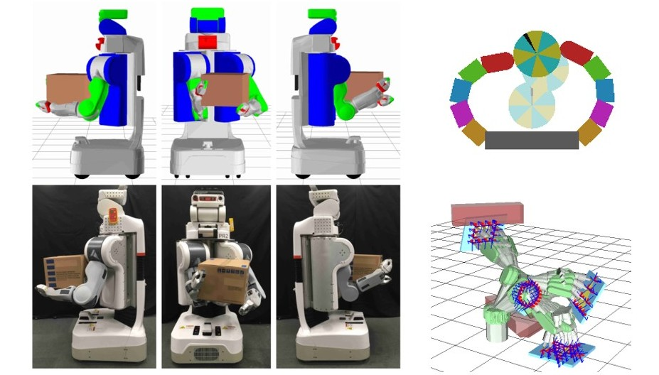
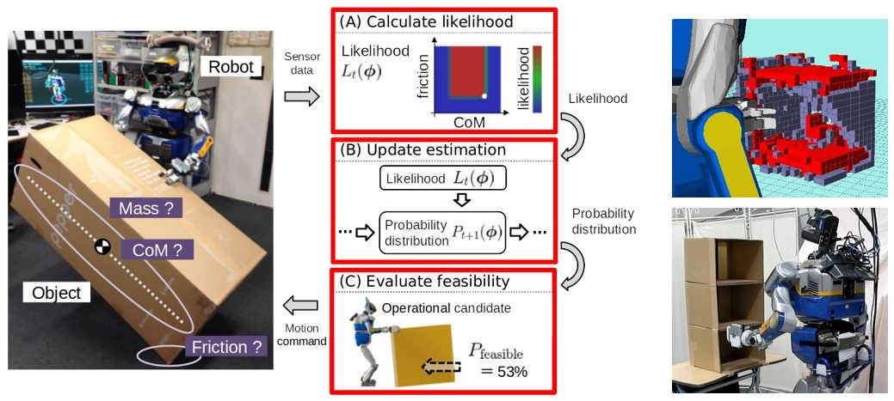

| [**GitHub**](https://github.com/mmurooka) | [**Google Scolar**](https://scholar.google.com/citations?user=d3XKqo0AAAAJ&hl=ja&oi=ao) | [**LinkedIn**](www.linkedin.com/in/masaki-murooka-66416a361) | [**researchmap**](https://researchmap.jp/MasakiMurooka) |

産業技術総合研究所 主任研究員  
博士 (情報理工学)  
室岡 雅樹 (Masaki Murooka)  

# Research

## Whole-body manipulation by humanoid

- Humanoid loco-manipulations pattern generation and stabilization control, RA-Letters 2021. [video](https://www.youtube.com/watch?v=tiNfTSLoMkU&list=PL_MvP6ejFrHu0oTEY-iSzhu6t8Nmu5l-s)
- Humanoid loco-manipulation planning based on graph search and reachability maps, RA-Letters 2021. [video](https://www.youtube.com/watch?v=fNJDMrAFpaA&list=PL_MvP6ejFrHu0oTEY-iSzhu6t8Nmu5l-s)
- Global planning of whole-body manipulation by humanoid robot based on transition graph of object motion and contact switching, Advanced Robotics 2017. [video](https://www.youtube.com/watch?v=CvJjZkMIHU8&list=PL_MvP6ejFrHu0oTEY-iSzhu6t8Nmu5l-s)
- Whole-body holding manipulation by humanoid robot based on transition graph of object motion and contact, IROS 2015. [video](https://www.youtube.com/watch?v=_KJdUh_pIRE&list=PL_MvP6ejFrHu0oTEY-iSzhu6t8Nmu5l-s)
- Whole-body pushing manipulation with contact posture planning of large and heavy object for humanoid robot, ICRA 2015. [video](https://www.youtube.com/watch?v=N2tTTRPpvf0&list=PL_MvP6ejFrHu0oTEY-iSzhu6t8Nmu5l-s)
- 等身大ヒューマノイドにおける物体状態・操作力オンライン推定制御法に基づく大型重量物ピボット運搬行動の実現, 日本ロボット学会誌 2014. [video](https://www.youtube.com/watch?v=5CXmmXsV9Ng&list=PL_MvP6ejFrHu0oTEY-iSzhu6t8Nmu5l-s)
- Manipulation strategy decision and execution based on strategy proving operation for carrying large and heavy objects, ICRA 2014. [video](https://www.youtube.com/watch?v=nmDnFCsyX04&list=PL_MvP6ejFrHu0oTEY-iSzhu6t8Nmu5l-s)
- 操作応答の知覚による物理的整合性推論に基づくヒューマノイドの試行獲得型マニピュレーション, 博士論文 (東京大学大学院情報理工学系研究科) 2018. [video](https://www.youtube.com/watch?v=W87N9exZjpA&list=PL_MvP6ejFrHu0oTEY-iSzhu6t8Nmu5l-s)

## Multi-contact motion control of humanoid

- Whole-body multi-contact motion control for humanoid robots based on distributed tactile sensors, RA-Letters 2024. [video](https://www.youtube.com/watch?v=I0OZYr-53uU)
- Centroidal trajectory generation and stabilization based on preview control for humanoid multi-contact motion, RA-Letters 2022. [video](https://www.youtube.com/watch?v=JC9jA9nP4mw&list=PL_MvP6ejFrHu0oTEY-iSzhu6t8Nmu5l-s)

## Optimization-based robot motion generation

- Optimization-based posture generation for whole-body contact motion by contact point search on the body surface, RA-Letters 2020. [video](https://www.youtube.com/watch?v=1HPEa3-jifY&list=PL_MvP6ejFrHu0oTEY-iSzhu6t8Nmu5l-s)
- Whole-body posture evaluation and modification for crane-less servo-off operation of life-sized humanoid robot, Humanoids 2018. [video](https://www.youtube.com/watch?v=UXFDxMJGg7Q&list=PL_MvP6ejFrHu0oTEY-iSzhu6t8Nmu5l-s)
- コンフィギュレーションの時変時不変性と隣接性を考慮した時系列逆運動学最適化計算によるロボット運動生成, 計測自動制御学会論文集 2019. [video](https://www.youtube.com/watch?v=S1qMf9hXmAg&list=PL_MvP6ejFrHu0oTEY-iSzhu6t8Nmu5l-s)

## Physics reasoning for robot manipulation

- Simultaneous planning and estimation based on physics reasoning in robot manipulation, ICRA 2018. [video](https://www.youtube.com/watch?v=lImh4kWf_Fk&list=PL_MvP6ejFrHu0oTEY-iSzhu6t8Nmu5l-s)
- Feasibility evaluation of object manipulation by a humanoid robot based on recursive estimation of the object's physical properties, ICRA 2017. [video](https://www.youtube.com/watch?v=lFr0B2FBgIw&list=PL_MvP6ejFrHu0oTEY-iSzhu6t8Nmu5l-s)
- Planning and execution of groping behavior for contact sensor based manipulation in an unknown environment, ICRA 2016. [video](https://www.youtube.com/watch?v=e4B8ugg4zVY&list=PL_MvP6ejFrHu0oTEY-iSzhu6t8Nmu5l-s)

## Recognition, learning, and user interface for robot manipulation

- ロボットマニピュレーションにおける幾何要素対応に基づく三次元物体姿勢認識, 日本ロボット学会学術講演会 2018. [video](https://www.youtube.com/watch?v=Shz6vbPbti0&list=PL_MvP6ejFrHu0oTEY-iSzhu6t8Nmu5l-s)
- ロボットマニピュレーションにおける画像内物体の深層学習による運動予測, 人工知能学会全国大会 2017. [video](https://www.youtube.com/watch?v=-ijKfkpXLxg&list=PL_MvP6ejFrHu0oTEY-iSzhu6t8Nmu5l-s)
- 手動修正可能な自律認識行動システムによる未知遠隔環境下での全身マニピュレーション実現法, 日本ロボット学会学術講演会 2015. [video](https://www.youtube.com/watch?v=9MI38_CKcKI&list=PL_MvP6ejFrHu0oTEY-iSzhu6t8Nmu5l-s)
- Manipulation strategy learning for carrying large objects based on mapping from object physical property to object manipulation action in virtual environment, CASE 2014. [video](https://www.youtube.com/watch?v=VL3DOERdm-A&list=PL_MvP6ejFrHu0oTEY-iSzhu6t8Nmu5l-s)

# Publications

[List of papers and awards](./publications.md)

# Software

[Open-source software for robotics](./software.md)

# Career
2022年10月-現在  
産業技術総合研究所 情報・人間工学領域 AIST-CNRSロボット工学連携研究ラボ 主任研究員

2023年4月-2024年3月  
経済産業省 製造産業局 産業機械課 ロボット政策室（産総研からの出向）

2020年4月-2022年9月  
産業技術総合研究所 情報・人間工学領域 AIST-CNRSロボット工学連携研究ラボ 研究員

2018年4月-2020年3月  
東京大学大学院 情報理工学系研究科 知能機械情報学専攻 特任助教

2015年4月-2018年3月  
日本学術振興会特別研究員 (DC1)

# Education
2018年3月  
東京大学大学院 情報理工学系研究科 知能機械情報学専攻 博士課程修了

2015年3月  
東京大学大学院 情報理工学系研究科 知能機械情報学専攻 修士課程修了

2013年3月  
東京大学 工学部 機械情報工学科 卒業

# Projects
## 研究代表
人間からの教示により情報獲得可能な対話型ロボット動作計画システム  
科学研究費助成事業 若手研究 2022年4月-2025年3月 (研究代表者)

数理モデルと実演解析によるロボット身体と行動知能の同時探索の理論構築と実世界適用  
科学研究費助成事業 若手研究 2019年4月-2022年3月 (研究代表者)

ヒューマノイドによる日常環境マニピュレーションの物理モデル内在・獲得統合型実現法  
科学研究費助成事業 研究活動スタート支援 2018年8月-2020年3月 (研究代表者)

実環境反映空間での注意操作性評価によるヒューマノイドの未知遠隔環境自律行動実現法  
科学研究費助成事業 特別研究員奨励費 2015年4月-2018年3月 (研究代表者)

## 研究分担
サイバーフィジカルヒューマンによる全身接触運動の包括的データ駆動学習・予測・生成  
科学研究費助成事業 基盤研究(S) 2022年4月-2027年3月 (研究分担者)

複雑未知環境下における即時動作を可能とする多点接触運動システムの実現  
科学研究費助成事業 基盤研究(B) 2021年4月-2024年3月 (研究分担者)
